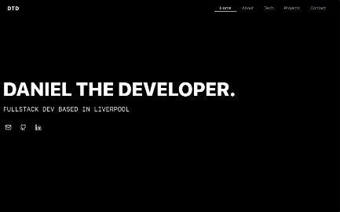

# Daniel The Developer - Portfolio Website

A modern, responsive portfolio website built with React, TypeScript, and Tailwind CSS showcasing my skills, projects, and professional background.

[](https://danielthedeveloper.vercel.app)

## 🚀 Live Demo

Visit the live website: [danielthedeveloper.vercel.app](https://danielthedeveloper.vercel.app)

## ✨ Features

- **Responsive Design** - Fully optimized for all device sizes
- **Modern UI/UX** - Clean and professional interface with smooth animations
- **Project Showcase** - Highlighting my work with links to live demos and GitHub repos
- **Tech Stack Display** - Organized presentation of technical skills by category
- **Contact Form** - Direct communication channel for potential clients and employers
- **Dark Mode Navigation** - Enhanced user experience with context-aware navigation

## 🛠️ Built With

- [React](https://reactjs.org/) - Frontend library
- [TypeScript](https://www.typescriptlang.org/) - Type-safe JavaScript
- [Tailwind CSS](https://tailwindcss.com/) - Utility-first CSS framework
- [Lucide React](https://lucide.dev/) - Beautiful SVG icons

## 🔧 Installation & Setup

1. Clone the repository
   ```bash
   git clone https://github.com/danieltanurhan/portfolio-DTD.git
   cd portfolio-DTD
   ```

2. Install dependencies
   ```bash
   npm install
   ```

3. Run the development server
   ```bash
   npm start
   ```

4. Open [http://localhost:3000](http://localhost:3000) to view it in the browser

## 📂 Project Structure

```
portfolio-DTD/
├── public/               # Public assets
├── src/                  # Source files
│   ├── App.tsx           # Main application component
│   ├── index.tsx         # Entry point
│   ├── components/       # Reusable components
│   ├── styles/           # CSS/Tailwind styles
│   └── assets/           # Images and other assets
├── .gitignore            # Git ignore file
├── package.json          # NPM package configuration
├── tsconfig.json         # TypeScript configuration
└── README.md             # Project documentation
```

## 📝 Customization

To customize this portfolio for your own use:

1. Update the projects array in `App.tsx` with your own projects
2. Modify the tech stack categories and skills to match your expertise
3. Update the contact information with your own details
4. Replace any placeholder text in the About section with your personal bio
5. Customize colors, fonts and other styling as needed

## 📤 Deployment

### Deploying to Vercel

1. Push your code to a GitHub repository
2. Import the project in [Vercel](https://vercel.com)
3. Configure build settings if needed
4. Deploy!

### Deploying to Netlify

1. Push your code to a GitHub repository
2. Import the project in [Netlify](https://netlify.com)
3. Configure build command: `npm run build`
4. Configure publish directory: `build`
5. Deploy!

## 📄 License

This project is licensed under the MIT License - see the [LICENSE](LICENSE) file for details.

## 👤 Author

**Daniel Tanurhan**

- Website: [danielthedeveloper.vercel.app](https://danielthedeveloper.vercel.app)
- GitHub: [@danieltanurhan](https://github.com/danieltanurhan)
- LinkedIn: [@danieltanurhan](https://linkedin.com/in/danieltanurhan)
- Email: danieltanurhan@gmail.com

## 🙏 Acknowledgments

- [React Documentation](https://reactjs.org/docs/getting-started.html)
- [Tailwind CSS](https://tailwindcss.com/docs)
- [Lucide Icons](https://lucide.dev)
- All the amazing open source libraries that made this project possible

---

Made with ❤️ by Daniel Tanurhan
